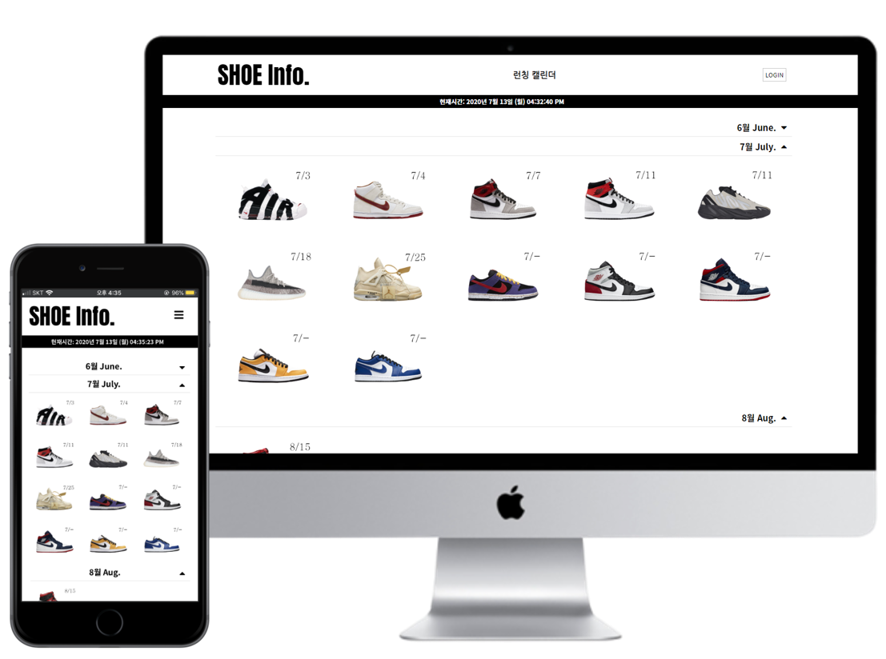
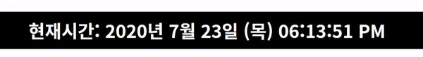

# ShoeInfo Project / 2020.04 - 2020.07

 Desktop, Mobile version preview 

  

 

## 주제
* **프리미엄 신발 발매 알림 사이트**

## 개발환경

* 개발도구
  * Eclipse Neon 3 `v4.6.3`
  * MySQL WorkBench `v8.0.17`
   
* 언어
  * JAVA SE1.8 `JDK 8`
  * JSP/Servlet `MVC`
  * HTML5/CSS3
  * JavaScript/Jquery
   
* 서버(WAS)
  * Apache Tomcat `v8.5`
   
* 커뮤니티
  * Google Document / Github

## 개요

### ShoeInfo 소개
프리미엄 신발의 발매 정보를 한곳에 모아서 정리해 놓은 웹 사이트

### 선정이유
발매 관련 정보들을 보다 보기 쉬운 형태의 구조로 사람들에게 서비스를 제공하기 위함

### 주요기능
* 런칭 캘린더(발매 정보) 게시판
* 나의 응모 여부 체크 게시판
* 관리자 데이터 관리 게시판
* 반응형 웹 기능

## DB 구성 - ER Diagram

  

## 기능구현 
* [메인 페이지](#메인-페이지)
* [신발 디테일 페이지](#신발-디테일-페이지)
  * [전체 레이아웃](#디테일-페이지-전체-레이아웃)
  * [세부 영역](#디테일-페이지-세부-영역)
* [나의 드로우(응모) 페이지](#나의-응모-페이지)

 

## 메인 페이지
* `JavaScript`를 이용한 실시간 시간 나타내기

 

* `jQuery` `slideToggle()` 함수를 활용한 월별 발매 신발 접었다/폈다 나타내기.

 

## 신발 디테일 페이지

### 디테일 페이지 전체 레이아웃
* 신발 기본 정보 영역
* 전세계 지역별 발매 브랜드 리스트
  * 한국 온라인 발매처
  * 아시아 온라인 발매처
  * 북미 온라인 발매처
  * 유럽 온라인 발매처
  * 기타 온라인 발매처

### 디테일 페이지 세부 영역
* 브랜드 이미지, 이름, 응모방식: 클릭했을시, 해당 브랜드 응모 사이트로 이동.
* 남은시간: 현재 시간 기준으로 발매시간과 비교하여 남은 시간 실시간으로 알려주기. `GIF 만들 당시 시간: 7월 23일 pm 06:53`
* 응모여부: 로그인을 했을시, 응모여부 체크를 통해 나의 페이지에 저장하기.

 

## 나의 응모 페이지
  

 

## 반응형 웹 미리보기

### 메인페이지

### 신발 디테일 페이지

### 나의 응모 페이지

 

## 라이센스
Copyright © 2020 Jeong Hun Park.  
This project is ITWILL busan licensed.

